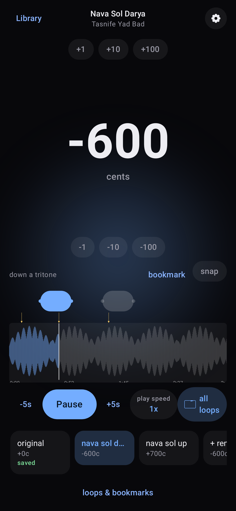
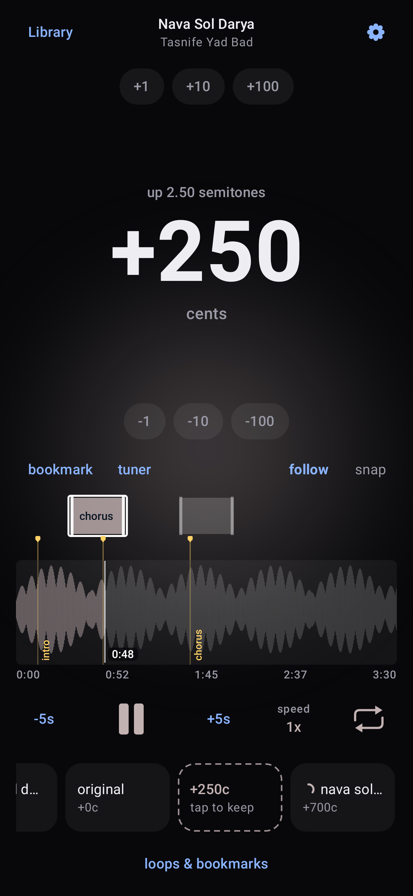

# pitcher

**Change the key of any song. Keep the tempo.**

pitcher moves music up or down by any interval, from a full octave to a single
cent, while the rhythm stays exactly where it was. Find the key with the built-in
tuner, loop and slow down the hard parts, and save the version you need as a file.

It is free and open source, works completely offline, and has no ads, accounts,
or tracking.

Website: <https://k1monfared.com/pitcher/>

<p align="center">
  
  &nbsp;
  
</p>

## Get it

**Android (10 or newer).** Download `pitcher-android-v2.6.4.apk` from the
[latest release](https://github.com/k1monfared/pitcher/releases/latest) and open it
on your phone. New versions install over the old one and keep your library.

**Linux desktop.** A command line tool and a local web app. See
[Desktop](#desktop) below.

## What you can do

- **Transpose** by any amount from one octave down to one octave up. Slide on the
  screen and hear the change as the song plays, use the step buttons, or type an
  exact value. Snap lands on semitones when you want it to.
- **Find the key.** The tuner names the note at the playhead or at a bookmark,
  with its exact cents. Choose the note you want and apply the interval in one tap.
- **Practice.** Make loops around the passages you work on, repeat one or play them
  in sequence, add named bookmarks, and change the play speed from half to double
  without changing the pitch.
- **Keep the pitches you like.** Each kept pitch sits on a shelf and is prepared in
  the background, so switching, saving, and sharing are quick.
- **Save and share** as WAV, MP3, M4A, or Opus. Save the whole song or only your
  loops, at normal speed or at your practice speed. Files sound exactly like the
  preview.
- **Stay private.** The Android app has no network permission. Nothing leaves your
  phone.

A short guided tour shows every control the first time you open a song.

## Desktop

The desktop version uses the Rubber Band library for high quality shifting with
optional formant preservation, which keeps voices natural.

```
# Debian or Ubuntu
sudo apt install rubberband-cli librubberband-dev aubio-tools libaubio-dev ffmpeg yt-dlp
cargo build --release
```

Command line:

```
./target/release/pitcher pitch in.wav out.wav --cents -100 --formant
./target/release/pitcher pitch in.wav out.wav --to-note C4 --from-note "C#4"
./target/release/pitcher detect in.wav --at 12.3
./target/release/pitcher interval C#4 C4
./target/release/pitcher add in.wav --title "My Track"
./target/release/pitcher explore 1 --offset -200 --span 400 --step 50
./target/release/pitcher shelf export 1 ./kept
```

Web app, served on the first free port from 7373 (the localhost and LAN addresses
are printed when it starts):

```
./scripts/pitcher-web.sh
```

It has a waveform with looping, a pitch fader with live audition, a tuner, and a
shelf of versions. It runs on your own machine. See the
[web app page](https://k1monfared.com/pitcher/web/).

Fetching audio from streaming sites with `yt-dlp` is subject to those sites'
terms. See [docs/LEGALITY.md](docs/LEGALITY.md).

## For developers

| Part | Stack |
| --- | --- |
| Desktop core and CLI | Rust, Rubber Band, YIN tuner, SQLite |
| Web app | axum server, Svelte 5 + Vite + TypeScript, soundtouchjs preview |
| Android app | Kotlin, Jetpack Compose, Media3 (ExoPlayer and Sonic) |

```
cargo test                                            # Rust
cd web && npm install && npm test                     # web app
cd android && ./gradlew :core:test :app:testFdroidDebugUnitTest   # Android
```

Building the Android app, signing, screenshots, and releases are covered in
[android/README.md](android/README.md). The design history is in [docs/](docs/),
and the Android release notes are in [android/CHANGELOG.md](android/CHANGELOG.md).

```
crates/pitcher-core/   engine, tuner, note math, sqlite shelf, import, model
crates/pitcher-cli/    the pitcher binary
server/                axum REST server over pitcher-core (serves web/dist)
web/                   Svelte 5 + Vite + TS frontend
site/                  project website (GitHub Pages)
docs/                  plans and legality notes
android/core/          pure Kotlin logic, tested on the JVM
android/app/           the Android app
fastlane/              store listing text and screenshots
```

## License

GPL-3.0. See [LICENSE](LICENSE).

<sub>Written with DeepSeek V4.1 Flash and Opus 5.5.</sub>
